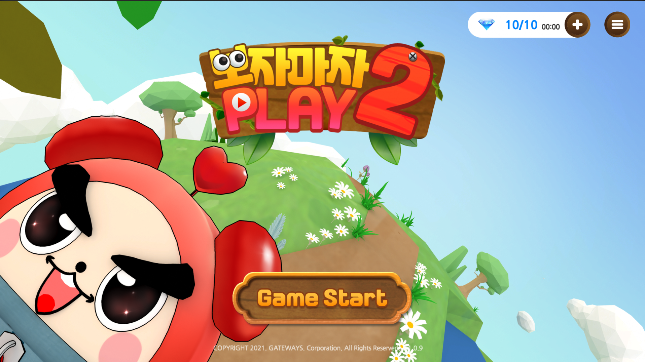
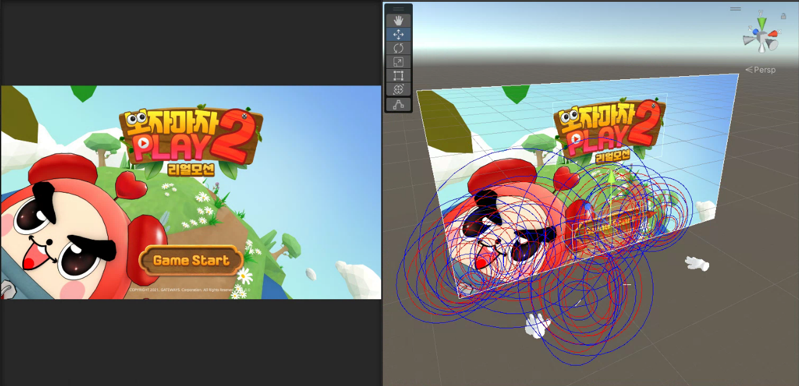

<div align="center">

# 🎮 보자마자 PLAY 2 (Bojamaja PLAY 2)

**10종 이상의 캐주얼 미니게임 모음집 — 터치(모바일)와 LeapMotion 손동작, 두 가지 입력 버전**
*A casual mini-game collection (10+ games) built in two input variants — touch (mobile) and Leap Motion hand-gestures.*

<p align="center">
  
  
</p>

**[🇰🇷 한국어](#-한국어)** · **[🇺🇸 English](#-english)**

`Unity3D (C#)` · `Firebase Realtime DB` · `Leap Motion SDK` · `AdMob` · `DOTween` · `캐주얼 미니게임`

</div>

---

## 🇰🇷 한국어

### 📘 프로젝트 소개

**보자마자 PLAY 2** 는 한 앱에 **10종 이상의 미니게임**을 담은 캐주얼 게임 모음집입니다. 각 게임은 30초 동안 진행되며, **클래식 모드**(원하는 게임을 골라 플레이 → 점수에 따라 별 ★)와 **랭킹 모드**(10개 랜덤 게임 연속 플레이 → 총점으로 글로벌 랭킹 경쟁)를 제공합니다. **Firebase 실시간 랭킹**과 별점 보상으로 경쟁·재플레이 동기를 만들었습니다.

이 저장소는 같은 게임의 **두 입력 버전**을 한곳에 모았습니다:

| 버전 | 입력 방식 | 플랫폼 | 폴더 |
|------|-----------|--------|------|
| **모바일** | 터치 | Android / iOS | [`Mobile/`](Mobile/) |
| **리얼모션** | **Leap Motion 손동작(비접촉)** | Windows(리얼모션) · Android/iOS | [`RealMotion/`](RealMotion/) |

> 각 버전의 상세 문서·코드·스크린샷은 폴더 안의 README를 참고하세요 → **[Mobile/README](Mobile/README.md)** · **[RealMotion/README](RealMotion/README.md)**

### 📅 버전별 개발 개요

| 구분 | 모바일 (Mobile) | 리얼모션 (Real Motion) |
|------|------------------|------------------------|
| **기간** | 2021.06 ~ 2021.12 (6개월) | 2020.11 ~ 2021.08 (10개월) |
| **팀 / 역할** | 팀 4명 · UI/게임로직/랭킹/클래식 모드 | 팀 2명 · UI/게임로직/랭킹/**제스처 인식 통합** |
| **핵심 기술** | AdMob 광고, Firebase 랭킹, 모바일 최적화 | **Leap Motion SDK**, Firebase, DOTween, VideoPlayer |
| **차별점** | 터치 기반 모바일 배포·광고/인앱 구조 | **비접촉 제스처 UX**(손동작으로 메뉴·조작) |

### ✨ 핵심 기능 (공통)

- 🕹️ **10종+ 미니게임 통합** — 장난감 조립 · 볼링 · 해적선 · 전골 · 보석 찾기 · 축구 · 좀비 · 피자 · 먼지 털기 · 샌드위치
- 🏅 **2개 모드** — 클래식(별 ★ 보상) · 랭킹(10게임 총점 → 글로벌 랭킹)
- ☁️ **Firebase 실시간 랭킹** — 점수 저장/조회, 전 세계 경쟁 (`RankingManager`)
- ⏱️ **Coroutine 타이머** — 각 게임 30초 통합 제어, 종료 시 결과·랭킹 연동
- 🌟 **별점 보상 + DOTween 연출** — 점수 구간별 별 획득, 애니메이션 피드백

### 🎮 입력 버전별 하이라이트

- **모바일** — 터치 입력, **AdMob 보상형 광고**·인앱 보상, Firebase 랭킹, FPS/씬 전환 최적화. (`GameManager`, `ScoreManager`, `RankingManager`, `AdManager`)
- **리얼모션** — **Leap Motion 손동작**을 버튼/선택/조작으로 매핑한 **비접촉 UX**, 제스처 튜토리얼(Pinch/Swipe), 실감형 피드백. (`GestureManager`, `GameFlowManager`, `TutorialManager`)

### 🎲 포함된 미니게임 (10종)

장난감 조립 · 볼링 · 해적선 맞추기 · 전골 끓이기 · 보석 찾기 · 축구 · 좀비 막기 · 피자 돌리기 · 먼지 털기 · 샌드위치 만들기
(스크린샷·상세는 [Mobile/README](Mobile/README.md) 참고)

### 📁 레포지토리 구성

```
.
├─ Mobile/        # 터치(모바일) 버전 — Scripts, Screenshots, README
├─ RealMotion/    # Leap Motion 손동작 버전 — Scripts, Screenshots, README
└─ README.md      # (이 문서) 통합 개요
```

> 포트폴리오용 코드·자료 모음입니다(전체 Unity 프로젝트가 아닌 핵심 스크립트·스크린샷 큐레이션).

---

## 🇺🇸 English

### 📘 Overview

**Bojamaja PLAY 2** is a casual game collection bundling **10+ mini-games** in one app. Each game runs for 30 seconds, with a **Classic mode** (pick a game → earn stars ★ by score) and a **Ranking mode** (10 random games in a row → compete on a global leaderboard by total score). **Firebase real-time ranking** and a star-reward system drive competition and replay.

This repository unifies **two input variants** of the same game:

| Variant | Input | Platform | Folder |
|---------|-------|----------|--------|
| **Mobile** | touch | Android / iOS | [`Mobile/`](Mobile/) |
| **Real Motion** | **Leap Motion hand-gestures (touchless)** | Windows · Android/iOS | [`RealMotion/`](RealMotion/) |

> See each variant's README for full details, code, and screenshots → **[Mobile/README](Mobile/README.md)** · **[RealMotion/README](RealMotion/README.md)**

### 📅 Per-variant Summary

| | Mobile | Real Motion |
|---|---|---|
| **Period** | Jun–Dec 2021 (6 mo) | Nov 2020 – Aug 2021 (10 mo) |
| **Team / Role** | 4 devs · UI/game-logic/ranking/classic mode | 2 devs · UI/game-logic/ranking/**gesture integration** |
| **Core tech** | AdMob ads, Firebase ranking, mobile optimization | **Leap Motion SDK**, Firebase, DOTween, VideoPlayer |
| **Differentiator** | touch-based mobile release + ads/IAP | **touchless gesture UX** (hands control menus & play) |

### ✨ Key Features (shared)

- 🕹️ **10+ mini-games** — toy assembly · bowling · pirate ship · hotpot · gem hunt · soccer · zombie defense · pizza spin · dusting · sandwich
- 🏅 **2 modes** — Classic (★ rewards) · Ranking (10-game total → global leaderboard)
- ☁️ **Firebase real-time ranking** — save/query scores, global competition (`RankingManager`)
- ⏱️ **Coroutine timer** — unified 30s control per game, results & ranking on end
- 🌟 **Star rewards + DOTween** — score-tier stars with animated feedback

### 🎮 Variant Highlights

- **Mobile** — touch input, **AdMob rewarded ads** / in-app rewards, Firebase ranking, FPS & scene-transition optimization (`GameManager`, `ScoreManager`, `RankingManager`, `AdManager`)
- **Real Motion** — **Leap Motion hand-gestures** mapped to buttons/selection/controls for a **touchless UX**, gesture tutorial (pinch/swipe), immersive feedback (`GestureManager`, `GameFlowManager`, `TutorialManager`)

### 📁 Repository Layout

```
.
├─ Mobile/        # Touch (mobile) variant — Scripts, Screenshots, README
├─ RealMotion/    # Leap Motion gesture variant — Scripts, Screenshots, README
└─ README.md      # (this file) unified overview
```

> A portfolio curation of core scripts and screenshots — not the full Unity project.
